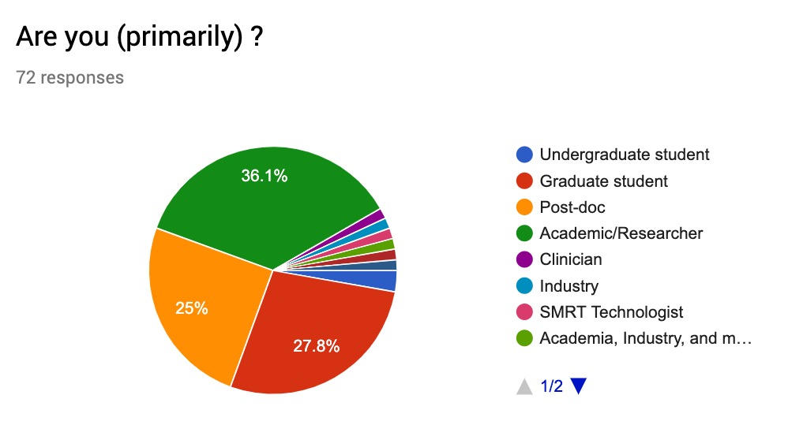
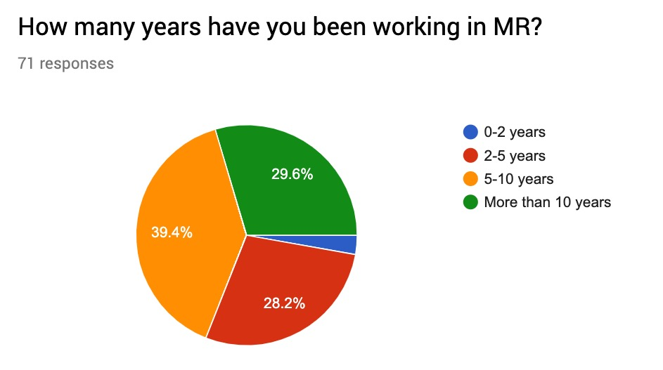
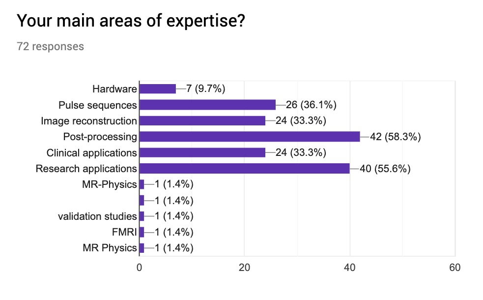
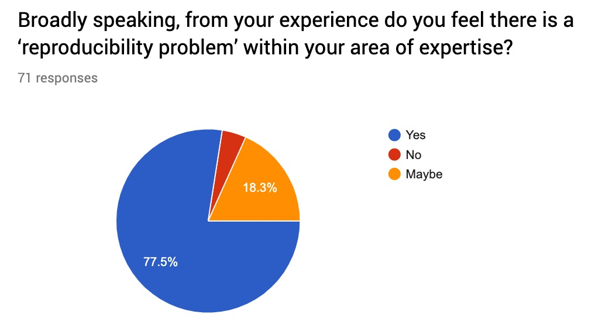
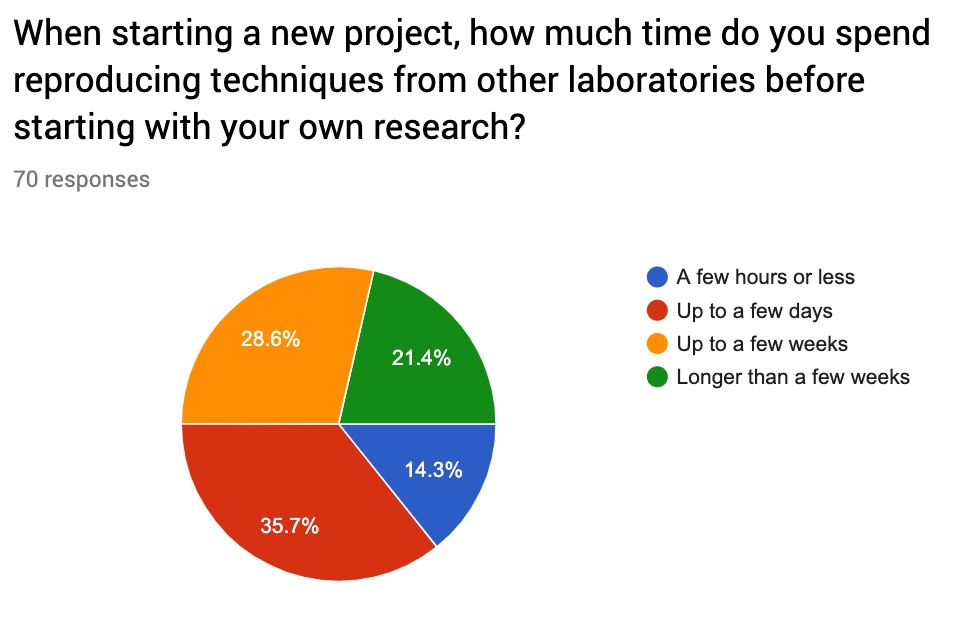
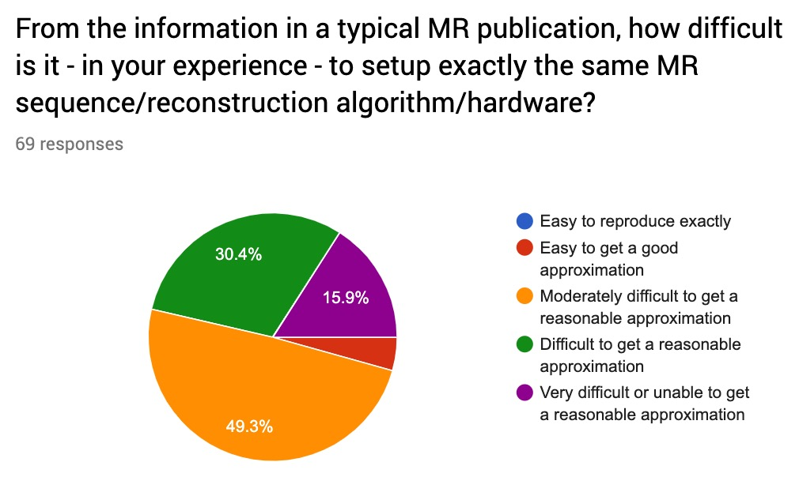
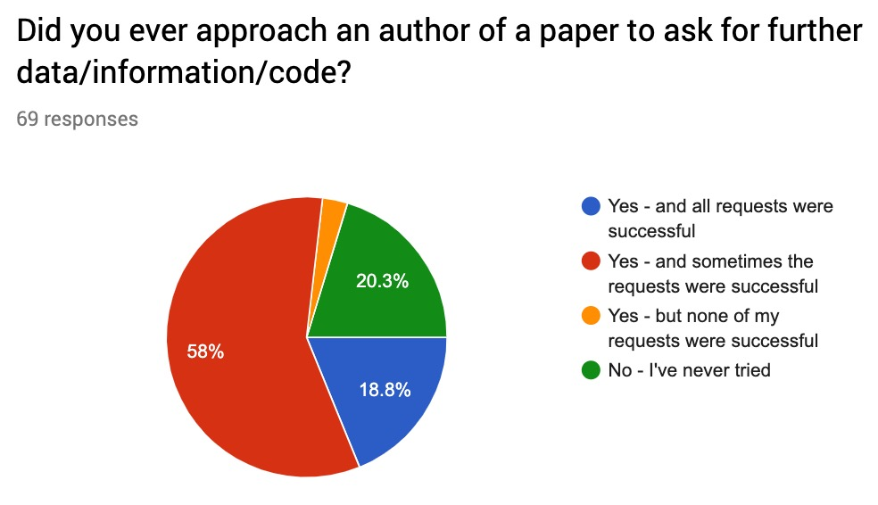

# RRSG Questionnaire 2019 - Summary

## Graphs

## Text answers

### What are the common problems that you encounter related to reproducibility?

<textarea rows="12" cols="120">
* New models do not quantify their reproducibility enough (for example in coefficients of variation, Bland-Altman).
* In image post-processing, the methodology sections of papers do not describe in great detail what image manipulation (processing) techniques have been applied to the raw signal to achieve the final parametric maps. Even in region of interest analysis the effect sizes when you are looking at a specific clinical application, say FA or CBF (from ASL) in Alzheimer's disease vary widely across reported studies.
* Low confidence that published values of MR biomarkers are at all comparable between centres.
* Research exams on various scanners (different hardware/software)
Comparisons to literature methods is hard, as there is rarely any no code available.
Lack of detail in publications.
* Reproduciblity, Reliability
* Lack of technical details on papers about sequence parameters and post processing steps
* Differences in PSD implementations related to quantitative MRI.
* scan-rescan reproducibility can be poor, quantitative measures are different across sites and vendors
* Experiments are not reproducible. Preprocessing is an art and it is not possible to tell if the paradigms or the data is the problem.
* Tuning recon parameters for comparing newer algorithms
* No code sharing or publicly available example codes
* Particularly when trying to implement other published algorithms for use in my own work. It's not that the code doesn't work or that the paper is wrong, just that many don't distribute their code or fully describe their methods.
* Missing hints in the methodology of publications (maybe due to word limitation).
image data is repeatable in each individual.
* Defining the study cohort in clinical studies. For reproducibility, you would want a homogeneous cohort, however for clinic, you want your new methods to work in a wider, more heterogeneous cohort.
* Spectral fitting
* Lack of codes for published research and lack of interest in sharing codes.
incomplete information and access to data
* Described techniques are not as robust as claimed
* Lack of access to pulse sequences
* Getting the necessary details from the nifti files to properly use a field map and having the computational evironment available to analyze the data.
* Implementation of the paper (code) is not share every time
* Papers do not offer enough details to reproduce hardware.
* nonpublished code
* We develop tools and pipelines. Most of the time, when people submit a paper, they do not submit code / data, so it's almost impossible to reproduce the results. Even when sharing data / code between labs for projects, people can rarely run the pipeline and get identical results.
* Standardized methods across scanners (models and vendors)
* Lack of standard datasets and test bench.
* Hardware is one hard to address
* All the different options for post processing
* Many important details are not given in the publications
original code and data are too often unavailable, low powered studies, questionable research practices (HARKing, p-hacking, ...)
* Insufficient information (lack of details)
* No code or data availiable, therefore true comparisons are hard
* researchers do not share the data and hardware is not designed to store raw data and make it available for analysis
* The results from other groups are difficult to reproduce without access to their code.
* Time and effort required to create code that is easy to use for those who don't write it (I've had issues trying to run other people's code, and it takes significant time for me to clean up my code when I do publish something, and I'm guessing it'd be pretty hard for someone other than myself to run)
* Different pulse sequences, different software, give different results
Reproducing clinical results is very challenging ( correlations between MRI parameters and clinical outcome)
* Methods descriptions are sometimes unclear and could be written to aid understanding. Steps that might seem trivial to authors or domain experts are sometimes described in one line when there are parameter/tuning choices etc.
* Insufficient methodological details
* Imaging sequence parameters only partially reported and also post-processing steps
intentionally vague schematics lacking any kind of engineering detail
* Lacking information, code is not shared,
* not shared code, low data access
* lack of standardization of acquisition, image processing
* Complex iterative methods are very time consuming to implement correctly and check from other's work in the field.
* Differences in manufacturer implementation, and also user workflow
* Lack of sufficient detail (methods and data) in publications for proper independent validation of results.
* Highly complex algorithms, incomplete descriptions, code not shared
* results are shown better then they are by covering up unwanted results or conflicting finidings. validating other work is not regarded as novel or innovative an leads to a lot of rejected work.
* Missing details on what exactly has been done (also in the "not so important" description of calibration and shimming routines);
* un-sufficiently reported methods in publications
* New MR sequences are often institute-dependent, and sharing sequences and other information is still something many research groups rather not do.
* Reproduce findings in clinical research across different study samples and/or different acquisition settings, thus making it difficult to evaluate the true biological meaning of results
* New methods need lot's of fine tuning to produce the desired result. Improvements often smaller than in the original study.
* Clinicians don't understand image analysis and analyze the information incorrectly.  Different analysis software packages give different results for similar tests and it is uncertain how the analysis behind the scenes differs (unless you are a programming expert, which most clinicians are not)...
* Difficulty to publish non-novel studies
* Lack of documentation surrounding raw data. Vendors not supplying data in ISMRMRD format.
* Access to software, access to data
* sequences are differently implemented by vendors which makes comparison across sites difficult.
* experiment variability (fMRI, DWI, QSM studies) due to pulse sequence difference between vendors, subject motion, and gradient heating and nonlinearity

</textarea>