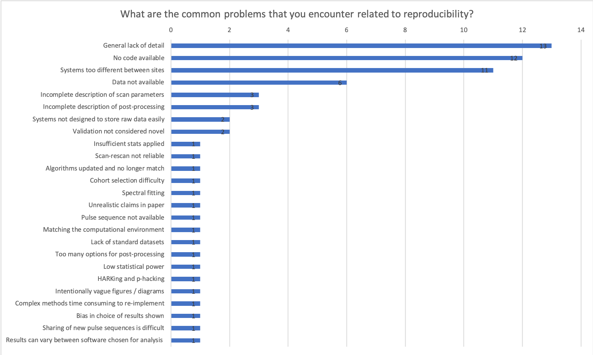
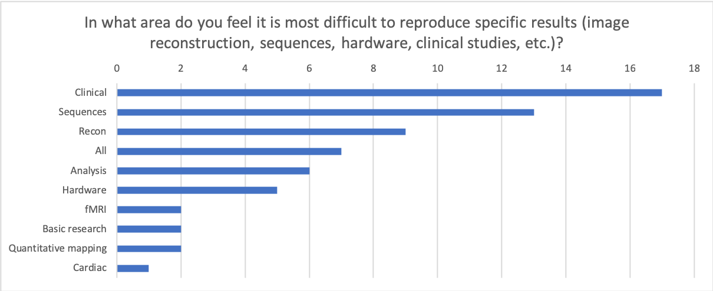
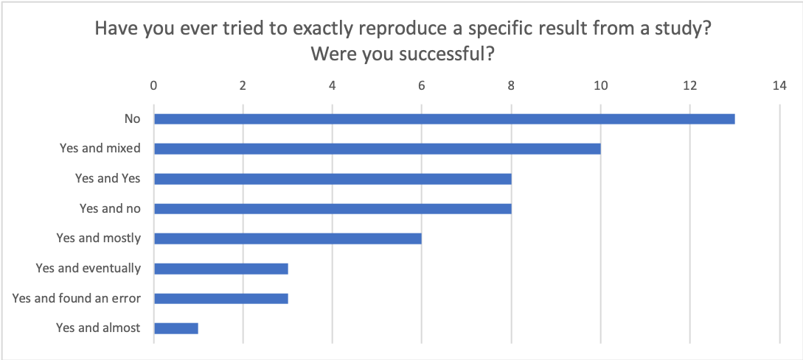
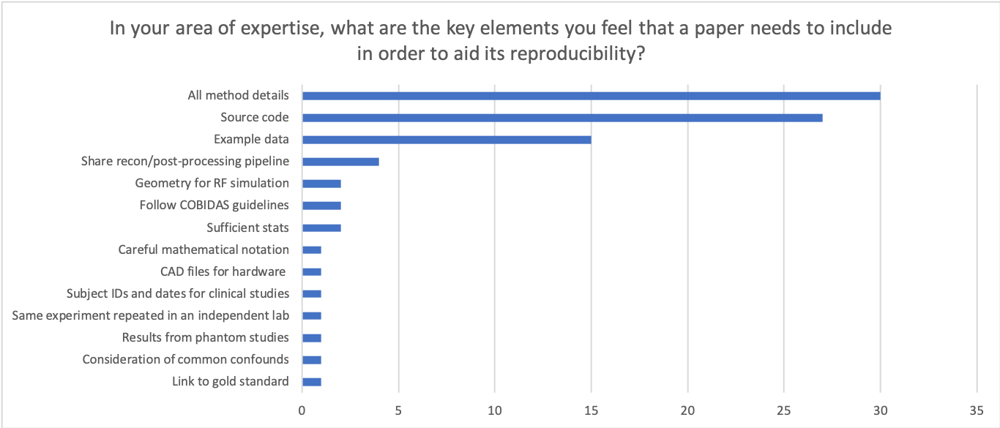
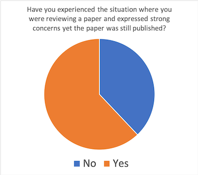
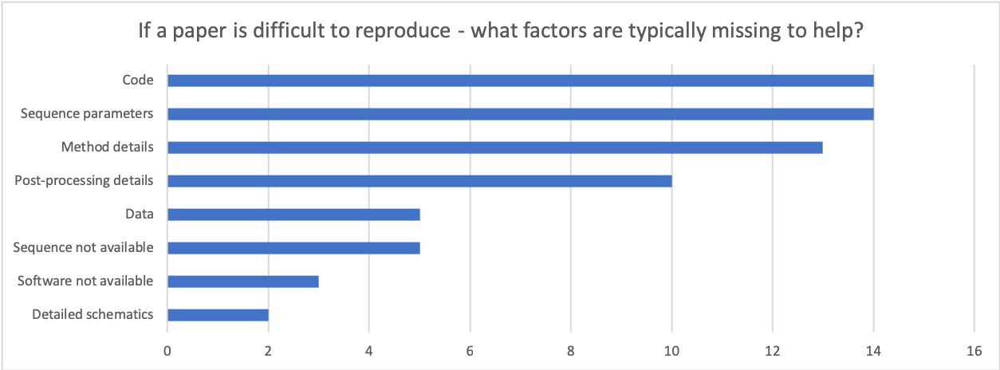

Many thanks to all who took the time to participate and to provide your feedback. It's clear that the ISMRM community, while it may not be hanging from quite such a high precipice as more statistics-driven fields, also has its fair share of reproducibility problems. 

This is probably the main take-home message from the whole survey:

The results from the rest of the survey highlight that there are a number of factors that could be improved within our field - ranging right through from the hardware itself (e.g. attempting to match pulse sequences across vendors), image reconstruction algorithms, image processing pipelines and validation of new methods in representative cohorts.

<blockquote><h3>"Data and code or it didn't happen"</h3><footer>- Anonymous</footer></blockquote>

### Browse full responses:

You can read through all the answers provided to the survey [by clicking here](https://docs.google.com/forms/d/1AChuij7KAYEgJp9-7_jCnL3l7FrOMnSj_NkU6U-R7ls/viewanalytics).

### Summary of responses

